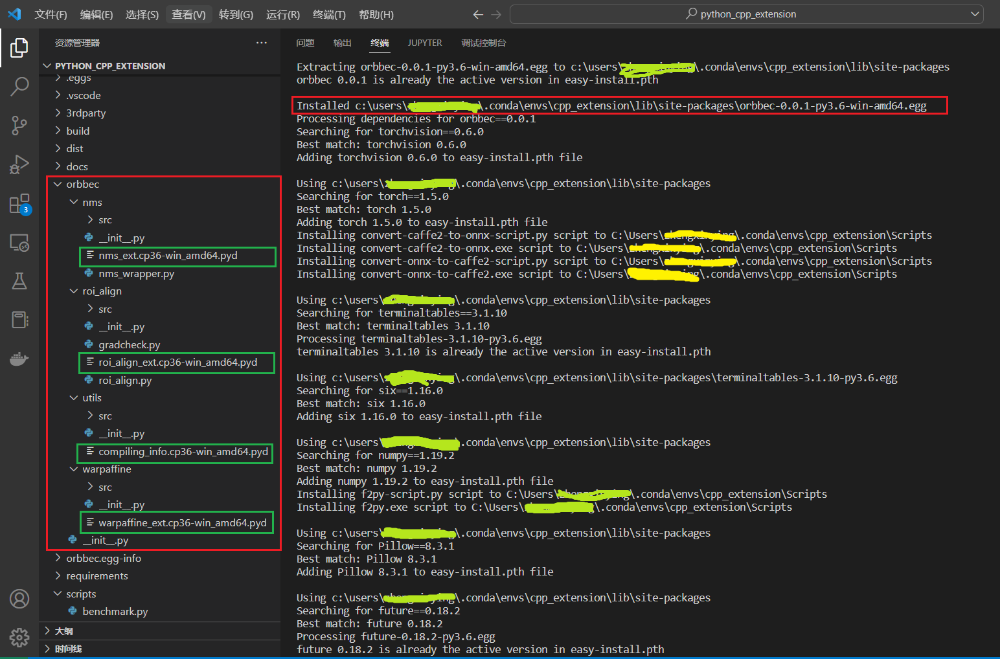
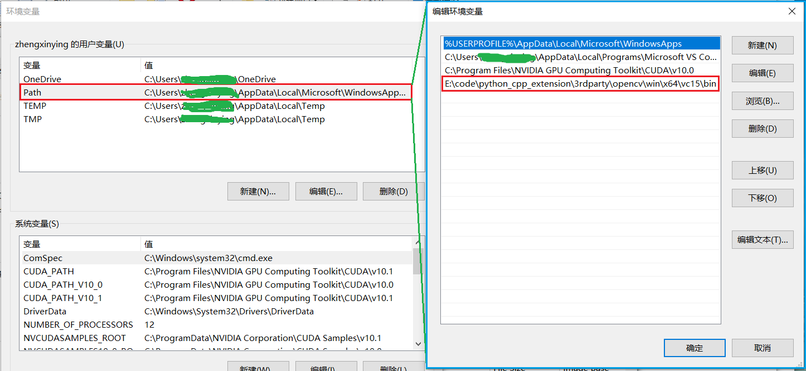
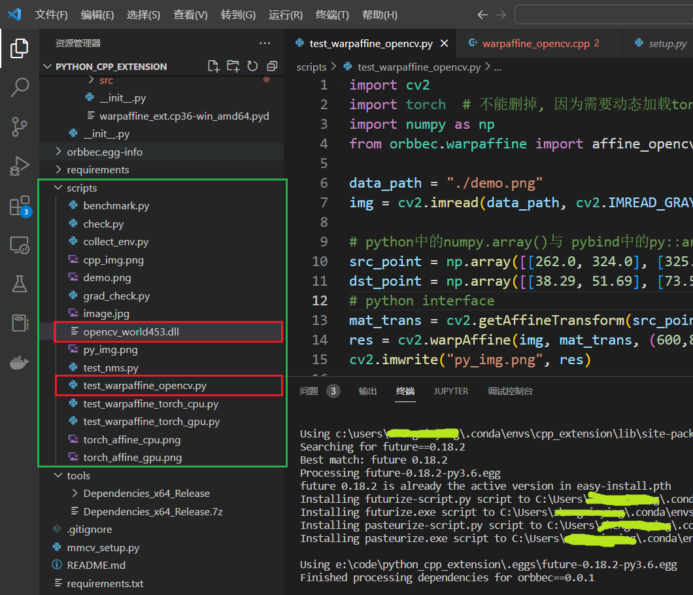

## Introduction：

​		一直以来，得益于GPU的日益发展，深度学习中网络训练以及部署推理速度越来越快，在各大主流的深度学习框架，诸如Pytorch、TensorFlow、OneFlow等都有很多算子对GPU的加速支持。从网络结构角度，Pytorch虽然已经使用了NVIDIA cuDNN、Intel MKL和NNPACK这些底层来加快训练速度，但是在某些情况下，比如我们要实现一些特定算法，如果只是用Pytorch已有的算子或操作远远不够。因为Pytorch虽然在特定操作上经过了很好的优化，但是对于Pytorch已经写好的这些操作，假如我们组合起来成为一个新的算子(OP)，Pytorch不会管你的算法的具体执行流程，一般Pytorch只会按照设计好的操作去使用GPU，然后GPU可能不能充分利用或者直接超负载，并且python解释器也不能对此进行优化，导致训练过程变慢很多[^1]。从数据流角度，**深度学习一般都需要复杂的、多阶段的数据处理流程，包括数据加载、解码以及一定量的数据增强预处理操作，这些目前在CPU上执行的数据处理管道已经成为瓶颈，使得模型训练耗时很长大**。对于此，NVIDIA提出了Data Loading Library (DALI)[^2]，通过将数据预处理交给GPU处理，缓解CPU瓶颈问题。DALI依赖于它自己的执行引擎，其构建目的是最大化输入管道的吞吐量。诸如预取、并行执行和批处理等特性都是为用户透明处理，如下图所示：

<center>
    
    <br>
    <div style="color:orange; border-bottom: 1px solid #d9d9d9;
    display: inline-block;
    color: #999;
    padding: 2px;">
      DALI Pipeline
  	</div>
</center>

​		使用DALI以及配置DALI环境比较复杂，并且DALI当前的支持的函数实现也比较有限，具体使用可以看文献[^2]中的说明文档。实际开发中，对于一些复杂的特定数据增强操作，就需要自己实现。因此，本工程利用Pytorch的C++/CUDA扩展，实现GPU的数据增强，然后直接推送给网络，从而达到训练加速效果。为了指导大家系统性掌握该方面的相关知识，本工程也包含了python的C++拓展，且详细讲解了在需要依赖第三方库的情况下怎样编写setup.py文件以及相关配置，关于如何编译和测试，在后续有详细的讲解。

## Project  Structure：

```python
├── 3rdparty          # 工程依赖的第三方库
│    ├── opencv
│    │    ├── linux
│    │    └── win
│    └── pybind11
├── docs              # 说明文档及相关资料
├── requirements      # python相关安装依赖
├── requirements.txt  # python相关安装依赖项, 与requirements文件夹配合
├── scripts           # 相关测试脚本
├── tools             # 分析工具
├── orbbec            # 源码文件
│    ├── nms          # 非极大值抑制
│    ├── roi_align    # ROI Align
│    ├── utils        # 编译工具函数
│    └── warpaffine   # 仿射变换增强
└── setup.py          # 用于编译和构建python包(.egg), 类似:CMakeLists.txt
```

## Compilation And Python Environment ：

### Compile Environment：

- [x] **GCC/G++ >= 5.5.0(Visual Studio 2017 or newer for Windows)**
- [x] **CUDA(NVCC): 10.1~11.5**
### Python Environment(requirements.txt)：

```python
certifi==2021.5.30
cycler==0.11.0
future==0.18.2
kiwisolver==1.3.1
matplotlib==3.3.4
mkl-fft==1.3.0
mkl-random==1.1.1
mkl-service==2.3.0
numpy @ file:///C:/ci/numpy_and_numpy_base_1603480701039/work
olefile==0.46
opencv-python==3.4.0.12
Pillow @ file:///C:/ci/pillow_1625663293114/work
pyparsing==3.0.9
python-dateutil==2.8.2
six @ file:///tmp/build/80754af9/six_1644875935023/work
terminaltables==3.1.10
torch==1.5.0
torchvision==0.6.0
wincertstore==0.2
```

### Python Package infos：

```python
Package         Version 
--------------- --------- 
certifi         2016.2.28
cycler          0.11.0
Cython          0.29.32
future          0.18.2
kiwisolver      1.3.1
matplotlib      3.3.4
mkl-fft         1.3.0
mkl-random      1.1.1
mkl-service     2.3.0
numpy           1.19.2
olefile         0.44
opencv-python   3.4.0.12
Pillow          8.3.1
pip             21.3.1
pyparsing       3.0.9
python-dateutil 2.8.2
setuptools      59.6.0
six             1.10.0
terminaltables  3.1.10
torch           1.5.0
torchvision     0.6.0
wheel           0.29.0
wincertstore    0.2
```

【注】：上述环境中的Pytorch版本需要对应的CUDA版本，本工程支持的Pytorch版本：**Pytorch version：1.5.0~latest**。

## C++ And CUDA Extensions For Python/Pytorch:

​		C++与python或pytotch的交互，业界主流做法是采用**pybind11**，关于Pybind11的更多详细说明可以参看文献[^15]，其核心原理如下图所示：

<center>
    
    <br>
    <div style="color:orange; border-bottom: 1px solid #d9d9d9;
    display: inline-block;
    color: #999;
    padding: 2px;">
      pybind11 pipeline
  	</div>
</center>
​		由于Pytorch的C++拓展与纯Python有一些区别，因为Pytorch的基础数据类型是**torch.Tensor**，该数据类型可以认为是Pytorch库对np.array进行了更高一层的封装。所以，在写拓展程序时，其接口函数所需要的数据类型以及调用的库会有些区别，下面会详细解释。

### C++  Extensions For Python：

​		首先我们看Python代码，如下所示(scripts/test_warpaffine_opencv.py)：

```python
import cv2
import torch  # 不能删掉, 因为需要动态加载torch的一些动态库,后面会详细说明.
import numpy as np
from orbbec.warpaffine import affine_opencv  # C++ interface

data_path = "./demo.png"
img = cv2.imread(data_path, cv2.IMREAD_GRAYSCALE)

# python中的numpy.array()与 pybind中的py::array_t一一对应.
src_point = np.array([[262.0, 324.0], [325.0, 323.0], [295.0, 349.0]], dtype=np.float32)
dst_point = np.array([[38.29, 51.69], [73.53, 51.69], [56.02, 71.73]], dtype=np.float32)
# python interface 
mat_trans = cv2.getAffineTransform(src_point, dst_point)
res = cv2.warpAffine(img, mat_trans, (600,800))
cv2.imwrite("py_img.png", res)

# C++ interface
warpffine_img = affine_opencv(img, src_point, dst_point)
cv2.imwrite("cpp_img.png", warpffine_img)
```

​		从上述代码可以看到，python文件中调用了affine_opencv函数，而affine_opencv的C++实现在orbbec/warpaffine/src/cpu/warpaffine_opencv.cpp中，如下所示：

```c++
#include<vector>
#include<iostream>
#include<pybind11/pybind11.h>
#include<pybind11/numpy.h>
#include<pybind11/stl.h>
#include<opencv2/opencv.hpp>


namespace py = pybind11;

/* Python->C++ Mat */
cv::Mat numpy_uint8_1c_to_cv_mat(py::array_t<unsigned char>& input)
{
	...
}

cv::Mat numpy_uint8_3c_to_cv_mat(py::array_t<unsigned char>& input)
{
	...
}

/* C++ Mat ->numpy */
py::array_t<unsigned char> cv_mat_uint8_1c_to_numpy(cv::Mat& input)
{
	...
}

py::array_t<unsigned char> cv_mat_uint8_3c_to_numpy(cv::Mat& input)
{
	...
}

py::array_t<unsigned char> affine_opencv(py::array_t<unsigned char>& input, 
                                        py::array_t<float>& from_point, 
                                        py::array_t<float>& to_point)
{
	...
}
```

​		由于本工程同时兼容了Pytorch的C++/CUDA拓展，为了更加规范，这里在拓展接口程序(orbbec/warpaffine/src/warpaffine_ext.cpp)中通过PYBIND11_MODULE定义好接口，如下所示：

```c++
#include <torch/extension.h>
#include<pybind11/numpy.h>

// python的C++拓展函数申明
py::array_t<unsigned char> affine_opencv(py::array_t<unsigned char>& input, 
                                        py::array_t<float>& from_point, 
                                        py::array_t<float>& to_point);

// Pytorch的C++拓展函数申明(CPU)
at::Tensor affine_cpu(const at::Tensor& input,          /*[B, C, H, W]*/
                      const at::Tensor& affine_matrix,  /*[B, 2, 3]*/
                      const int out_h,
                      const int out_w);

// Pytorch的CUDA拓展函数申明(GPU)
#ifdef WITH_CUDA
at::Tensor affine_gpu(const at::Tensor& input,          /*[B, C, H, W]*/
                      const at::Tensor& affine_matrix,  /*[B, 2, 3]*/
                      const int out_h,
                      const int out_w);
#endif

// 通过WITH_CUDA宏进一步封装Pytorch的拓展接口
at::Tensor affine_torch(const at::Tensor& input,          /*[B, C, H, W]*/
                  		const at::Tensor& affine_matrix,  /*[B, 2, 3]*/
                  		const int out_h,
                  		const int out_w)
{
	if (input.device().is_cuda())
  	{
#ifdef WITH_CUDA
    return affine_gpu(input, affine_matrix, out_h, out_w);
#else
    AT_ERROR("affine is not compiled with GPU support");
#endif
  	}
  	return affine_cpu(input, affine_matrix, out_h, out_w);
}

// 使用pybind11模块定义python/pytorch接口
PYBIND11_MODULE(TORCH_EXTENSION_NAME, m) {
  m.def("affine_opencv", &affine_opencv, "affine with c++ opencv");
  m.def("affine_torch", &affine_torch,   "affine with c++ libtorch");
}
```

​		从上面代码可以看出，**python中的np.array数组与pybind11的py::array_t相互对应，也即python接口函数中，传入的np.array数组，在C++对应的函数中用py::array_t接收，操作Numpy数组，需要引入头文件<pybind11/numpy.h>**。数组本质上在底层是一块一维的连续内存区，通过pybind11中的request()函数可以把数组解析成py::buffer_info结构体，buffer_info类型可以公开一个缓冲区视图，它提供对内部数据的快速直接访问，如下代码所示：

```c++
struct buffer_info {
    void *ptr;                         // 指向数组(缓冲区)数据的指针
    py::ssize_t itemsize;              // 数组元素总数
    std::string format;                // 数组元素格式(python表示的类型)
    py::ssize_t ndim;                  // 数组维度信息
    std::vector<py::ssize_t> shape;    // 数组形状
    std::vector<py::ssize_t> strides;  // 每个维度相邻元素的间隔(字节数表示)
};		
```

​		在写好C++源码以后，在setup.py中将相关C++源文件，以及依赖的第三方库：opencv、pybind11的路径写入对应位置(本工程已经写好，请具体看setup.py文件)，然后进行编译和安装：

```python
# 切换工作路径
step 1: cd F:/code/python_cpp_extension
# 编译
step 2: python setup.py develop
# 安装, 如果没有指定--prefix, 则最终编译成功的安装包(.egg)文件会安装到对应的python环境下的site-packages下.
step 3: python setup.py install
```

【注】：关于工程文件中的setup.py相关知识可以参考文献[^7][^12][^13]，该三篇文献对此有详细的解释。执行step2和step3之后，如下图所示，最终源码文件会编译成.pyd二进制文件（linux系统下编译成.so文件），且会生成一个python包文件：**orbbec-0.0.1-py36-win-amd64.egg**，包名取决于setup.py中规定的name和version信息，该安装包会被安装在当前python环境的site-packages文件夹下。同时，在终端执行命令：**pip list**，会发现安装包以及对应的版本信息。安装成功后，也就意味着，在该python环境(本工程的python环境是cpp_extension)下，可以在任何一个python文件中，导入orbbec安装包中的接口函数，比如上述scripts/test_warpaffine_opencv.py文件中的语句：**``from orbbec.warpaffine import affine_opencv``**。

<center>
    
    <br>
    <div style="color:orange; border-bottom: 1px solid #d9d9d9;
    display: inline-block;
    color: #999;
    padding: 2px;">
      编译和安装成功
  	</div>
</center>
<center>
    
    <br>
    <div style="color:orange; border-bottom: 1px solid #d9d9d9;
    display: inline-block;
    color: #999;
    padding: 2px;">
      安装成功后, packages信息
  	</div>
</center>

编译完成后，可以运行tools/collect_env.py，查看当前一些必要工具的版本等一系列信息，输出如下：

```python
sys.platform    : win32
Python  : 3.6.13 |Anaconda, Inc.| (default, Mar 16 2021, 11:37:27) [MSC v.1916 64 bit (AMD64)]
CUDA available  : True
CUDA_HOME       : C:\Program Files\NVIDIA GPU Computing Toolkit\CUDA\v10.1
NVCC    : Not Available
GPU 0   : NVIDIA GeForce GTX 1650
OpenCV  : 3.4.0
PyTorch : 1.5.0
PyTorch compiling details       : PyTorch built with:
  - C++ Version: 199711
  - MSVC 191627039
  - Intel(R) Math Kernel Library Version 2020.0.0 Product Build 20191125 for Intel(R) 64 architecture applications
  - Intel(R) MKL-DNN v0.21.1 (Git Hash 7d2fd500bc78936d1d648ca713b901012f470dbc)
  - OpenMP 200203
  - CPU capability usage: AVX2
  - CUDA Runtime 10.1
  - NVCC architecture flags: -gencode;arch=compute_37,code=sm_37;-gencode;arch=compute_50,code=sm_50;-gencode;arch=compute_60,code=sm_60;-gencode;arch=compute_61,code=sm_61;-gencode;arch=compute_70,code=sm_70;-gencode;arch=compute_75,code=sm_75;-gencode;arch=compute_37,code=compute_37
  - CuDNN 7.6.4
  - Magma 2.5.2
  - Build settings: BLAS=MKL, BUILD_TYPE=Release, CXX_FLAGS=/DWIN32 /D_WINDOWS  /GR  /w /EHa /bigobj -openmp -DNDEBUG -DUSE_FBGEMM, PERF_WITH_AVX=1, PERF_WITH_AVX2=1, PERF_WITH_AVX512=1, USE_CUDA=ON, USE_EXCEPTION_PTR=1, USE_GFLAGS=OFF, USE_GLOG=OFF, USE_MKL=ON, USE_MKLDNN=ON, USE_MPI=OFF, USE_NCCL=OFF, USE_NNPACK=OFF, USE_OPENMP=ON, USE_STATIC_DISPATCH=OFF,

TorchVision     : 0.6.0
C/C++ Compiler  : MSVC 191627045
CUDA Compiler   : 10.1
```

​		在运行scripts/test_warpaffine_opencv.py文件之前，由于warpaffine_opencv.cpp源码用到相关opencv库，因此，还需要配置动态库路径，windows系统配置如下：

<center>
    
    <br>
    <div style="color:orange; border-bottom: 1px solid #d9d9d9;
    display: inline-block;
    color: #999;
    padding: 2px;">
      opencv库路径配置
  	</div>
</center>

Linux系统同样也需要配置进行配置，命令如下：

```python
root@aistation:/xxx/code/python_cpp_extension# export LD_LIBRARY_PATH=/xxx/code/python_cpp_extension/3rdparty/opencv/linux/lib
root@aistation:/xxx/code/python_cpp_extension# ldconfig
```

也可以通过修改~/.bashrc文件，加入上述``export LD_LIBRARY_PATH=/...``，然后命令：``source ~/.bashrc``。也可以直接修改配置文件/etc/profile，与修改.bashrc文件一样，对所有用户有效。

​		如果是在服务器上训练模型，比如浪潮的AIStation，则可以将上述命令写入.sh脚本中，然后训练时直接脚本启动即可。如下所示：

```sh
# add dll path to env
export LD_LIBRARY_PATH=/jiaozhu01/code/insightface_ir_train
ldconfig

# run 
cd /jiaozhu01/code/insightface_ir_train/
OMP_NUM_THREADS=4 torchrun --standalone --nproc_per_node=2 --master_addr="127.0.0.1" --master_port=12581 train.py configs/mbf200.py

# kill process
ps -ef | grep "train" | grep -v grep | awk '{print "kill -9 "$2}' | sh
```

​		可以通过tools下的Dependencies_x64_Release工具(运行：DependenciesGui.exe)，查看编译好的文件(.pyd)依赖的动态库是否都配置完好，如下图所示：

<center>
    
    <br>
    <div style="color:orange; border-bottom: 1px solid #d9d9d9;
    display: inline-block;
    color: #999;
    padding: 2px;">
      检查编译好的动态库依赖的动态库路径
  	</div>
</center>
可以发现，该工具没有找到python36.dll、c10.dll、torch_cpu.dll、torch_python.dll和c10_cuda.dll的路径，这里说明一下，python相关的dll库以及torch相关的动态库是动态加载的，也就是说，如果你在python代码中写一句：**import torch**，只有在程序运行时才会动态加载torch相关库。所以，Dependencies_x64_Release工具检查不到编译好的warpaffine_ext.cp36-win_amd64.pyd文件依赖完好性。这里还需要说明一下为什么warpaffine_ext.cp36-win_amd64.pyd需要依赖torch相关库，这是因为源文件orbbec/warpaffine/src/warpaffine_ext.cpp兼容了pytorch的c++拓展，所以依赖torch和cuda相关动态库文件，如果你单纯只在orbbec/warpaffine/src/warpaffine_ext.cpp实现纯粹python的c++拓展，则是不需要依赖torch和cuda相关动态库。

​		配置好之后，还需要将warpaffine_ext.cp36-win_amd64.pyd无法**动态加载**的动态库文件(opencv_world453.dll)放到scripts/test_warpaffine_opencv.py同路径之下(Linux系统也一样)，如下图所示：

<center>
    
    <br>
    <div style="color:orange; border-bottom: 1px solid #d9d9d9;
    display: inline-block;
    color: #999;
    padding: 2px;">
      拷贝动态库与测试脚本同一目录
  	</div>
</center>
​		需要注意一个问题，有时候，如果在docker中进行编译和安装，其最终生成的python安装包(.egg)文件并不会安装到当前python环境下的site-packages中。也就意味着，在python文件中执行：``from orbbec.warpaffine import affine_opencv``会失败。原因是``orbbec.warpaffine``并不在其python的搜索路径中，这个时候有两种解决办法，一种是在执行：``python setup.py install``时，加上``--prefix='install path'``，但是经过本人验证，有时候不可行，另外一种办法是在python文件中，将``orbbec``文件夹路径添加到python的搜索路径中，如下所示：

```python
import cv2
import torch  # 不能删掉, 因为需要动态加载torch的一些动态库.
import numpy as np

# 添加下述两行代码，这里默认此python脚本所在目录的上一层目录路径包含orbbec文件夹.
_FILE_PATH = os.path.dirname(os.path.abspath(__file__))
sys.path.insert(0, os.path.join(_FILE_PATH, "../"))

from orbbec.warpaffine import affine_opencv  # C++ interface
```

### C++/CUDA Extensions For Pytorch:

​		Pytorch的C++/CUDA拓展同样也是利用Pybind11工具，但是，由于Pytorch使用的基础数据类型是torch.Tensor类型，因此，在写拓展程序中，必须要有libtorch库中对应的数据类型与Pytorch的tensor类型对应，这样才能进行正确传参。这里需要知道Pytorch对应的C++版本libtorch中几个常用的库和命名空间：

常用的**命名空间**：
①：at(ATen)负责声明和定义Tensor运算，是最常用到的命名空间；
②：c10是ATen的基础，包含了PyTorch的核心抽象、Tensor和Storage数据结构的实际实现；
③：torch命名空间下定义的Tensor相比于ATen 增加自动求导功能。

Pytorch的Aten目录下的主要构成：
①：ATen（ATen核心源文件）；
②：TH（Torch 张量计算库）；
③：THC（Torch CUDA张量计算库）；
④：THCUNN（Torch CUDA神经网络库）；
⑤：THNN(Torch神经网络库)。

​		C10是Caffe Tensor Library的缩写。这里存放的都是最基础的Tensor库的代码，可以运行在服务端和移动端，C10主要目的之一是为了统一Pytorch的张量计算后端代码和caffe2的张量计算后端代码。
​		libtorch中还有个csrc模块，主要适用于**C++和python的API之间的相互映射**，比如pytorch的nn.Conv2d对应于torch中的at:conv2d，其次是autograd和自动求导机制。了解如上内容后，首先来看python测试代码，如下所示(scripts/test_warpaffine_torch_cpu.py)：

```python
import cv2
import torch
import numpy as np
from orbbec.warpaffine import affine_torch  # C++ interface

data_path = "demo.png"

img = cv2.imread(data_path)
# transform img(numpy.array) to tensor(torch.Tensor)
# use permute
img_tensor = torch.from_numpy(img / 255.0).permute(2, 0, 1).contiguous()
img_tensor = img_tensor.unsqueeze(0).float()

src_tensor = torch.tensor([[38.29, 51.69, 1.0], [73.53, 51.69, 1.0], [56.02, 71.73, 1.0]], dtype=torch.float32).unsqueeze(0)
dst_tensor = torch.tensor([[262.0, 324.0], [325.0, 323.0], [295.0, 349.0]], dtype=torch.float32).unsqueeze(0)

# compute affine transform matrix
matrix_l = torch.transpose(src_tensor, 1, 2).bmm(src_tensor)
matrix_l = torch.inverse(matrix_l)
matrix_r = torch.transpose(src_tensor, 1, 2).bmm(dst_tensor)
affine_matrix = torch.transpose(matrix_l.bmm(matrix_r), 1, 2)

warpffine_img = affine_torch(img_tensor, affine_matrix, 112, 112)

warpffine_img = warpffine_img.squeeze(0).permute(1, 2, 0).numpy()
cv2.imwrite("torch_affine_cpu.png", np.uint8(warpffine_img * 255.0))
```

​		从上述代码可以看到，python文件中调用了affine_torch函数，并且传入的参数类型是cpu类型的tensor，而affine_torch的C++实现在orbbec/warpaffine/src/warpaffine_ext.cpp中，如下所示：

```c++
#include <torch/extension.h>
#include<pybind11/numpy.h>

// python的C++拓展函数申明
py::array_t<unsigned char> affine_opencv(py::array_t<unsigned char>& input, 
                                        py::array_t<float>& from_point, 
                                        py::array_t<float>& to_point);

// Pytorch的C++拓展函数申明(CPU)
at::Tensor affine_cpu(const at::Tensor& input,          /*[B, C, H, W]*/
                      const at::Tensor& affine_matrix,  /*[B, 2, 3]*/
                      const int out_h,
                      const int out_w);

// Pytorch的CUDA拓展函数申明(GPU)
#ifdef WITH_CUDA
at::Tensor affine_gpu(const at::Tensor& input,          /*[B, C, H, W]*/
                      const at::Tensor& affine_matrix,  /*[B, 2, 3]*/
                      const int out_h,
                      const int out_w);
#endif

// 通过WITH_CUDA宏进一步封装Pytorch的拓展接口
at::Tensor affine_torch(const at::Tensor& input,          /*[B, C, H, W]*/
                  		const at::Tensor& affine_matrix,  /*[B, 2, 3]*/
                  		const int out_h,
                  		const int out_w)
{
	if (input.device().is_cuda())
  	{
#ifdef WITH_CUDA
    return affine_gpu(input, affine_matrix, out_h, out_w);
#else
    AT_ERROR("affine is not compiled with GPU support");
#endif
  	}
  	return affine_cpu(input, affine_matrix, out_h, out_w);
}

// 使用pybind11模块定义python/pytorch接口
PYBIND11_MODULE(TORCH_EXTENSION_NAME, m) {
  m.def("affine_opencv", &affine_opencv, "affine with c++ opencv");
  m.def("affine_torch", &affine_torch,   "affine with c++ libtorch");
}
```

​		从上述代码可以看出，根据宏WITH_CUDA和tensor类型控制affine_torch最终底层执行affine_cpu还是affine_gpu函数。同时也注意到，**python中的torch.Tensor类型与libtorch库中的at::Tensor对应**。再看看affine_cpu函数的具体实现(orbbec/warpaffine/src/cpu/warpaffine_torch_v2.cpp)：

```c++
at::Tensor affine_cpu(const at::Tensor& input,          /*[B, C, H, W]*/
                      const at::Tensor& affine_matrix,  /*[B, 2, 3]*/
                      const int out_h,
                      const int out_w)
{
    at::Tensor result;
    // AT_DISPATCH_FLOATING_TYPES: input.scalar_type() => scalar_t
    AT_DISPATCH_FLOATING_TYPES(input.scalar_type(), "affine_cpu", [&] {
        result = affine_torch_cpu<scalar_t>(input, affine_matrix, out_h, out_w);
    });
    return result;
}
```

进一步看affine_torch_cpu函数的具体实现(orbbec/warpaffine/src/cpu/warpaffine_torch_v2.cpp)：

```c++
template <typename scalar_t>
at::Tensor affine_torch_cpu(const at::Tensor& input,          /*[B, C, H, W]*/
                            const at::Tensor& affine_matrix,  /*[B, 2, 3]*/
                            const int out_h,
                            const int out_w)  
{
    AT_ASSERTM(input.device().is_cpu(),         "input must be a CPU tensor");
    AT_ASSERTM(affine_matrix.device().is_cpu(), "affine_matrix must be a CPU tensor");

    auto matrix_ptr = affine_matrix.contiguous().data_ptr<scalar_t>();
    auto input_ptr = input.contiguous().data_ptr<scalar_t>();
    auto nimgs = input.size(0);
    auto img_c = input.size(1);
    auto img_h = input.size(2);
    auto img_w = input.size(3);
    auto in_img_size = img_c * img_h * img_w;
    auto out_img_size = img_c * out_h * out_w;

    // build dst tensor
    auto output_tensor = at::zeros({nimgs, img_c, out_h, out_w}, input.options());
    auto output_ptr = output_tensor.contiguous().data_ptr<scalar_t>();  
    
    for(int i = 0; i < nimgs; i++)
    {   
        scalar_t* matrix = matrix_ptr + i * 6; 
        scalar_t* in = input_ptr + i * in_img_size;
        scalar_t* out = output_ptr + i * out_img_size;
        affine_cpu_kernel<scalar_t>(img_h, img_w, img_c, img_w*img_h, 
                                    out_h, out_w, out_h*out_w, out, in, matrix, 0.0f);
    }

    return output_tensor;
}
```

​		这里有一个非常注意的地方就是，上述代码中的**tensor的.contiguous()方法(上述代码第10、11、21行)**。可以看到，我们在获取tensor的数据指针时候(**data_ptr<scalar_t>()**)，Pytorch官方示例代码和mmdtection/mmcv中的一些相关代码都推荐先做这个操作。这是因为，不管是在python还是在c++代码中，使用**permute()、transpose()、view()**等方法操作返回一个新的tensor时，其与旧的tensor是**共享数据存储**，所以他们的storage不会发生变化，只是会重新返回一个新的view，这样做的目的是减少数据拷贝，减少内存消耗，一定程度上加速网络训练或推理过程，如果在Python端对tensor做了.contiguous()操作，则在C++端就不需要再做了，因为.contiguous()是一个深拷贝操作。

<center>
    
    <br>
    <div style="color:orange; border-bottom: 1px solid #d9d9d9;
    display: inline-block;
    color: #999;
    padding: 2px;">
      permute操作分析
  	</div>
</center>
​		接下来，再来看pytorch的CUDA扩展，首先测试文件test_warpaffine_torch_gpu.py如下：

```python
import cv2
import torch
import numpy as np
from orbbec.warpaffine import affine_torch  # CUDA interface

data_path = "demo.png"

img = cv2.imread(data_path)
# transform img(numpy.array) to tensor(torch.Tensor)
# use permute
img_tensor = torch.from_numpy(img / 255.0).permute(2, 0, 1).contiguous()
img_tensor = img_tensor.unsqueeze(0).float()
img_tensor = img_tensor.cuda()  # gpu tensor

# dst -> src
src_tensor = torch.tensor([[38.29, 51.69, 1.0], [73.53, 51.69, 1.0], [56.02, 71.73, 1.0]], dtype=torch.float32).unsqueeze(0)
dst_tensor = torch.tensor([[262.0, 324.0], [325.0, 323.0], [295.0, 349.0]], dtype=torch.float32).unsqueeze(0)
src_tensor = src_tensor.cuda()  # gpu tensor
dst_tensor = dst_tensor.cuda()  # gpu tensor

# compute affine transform matrix
matrix_l = torch.transpose(src_tensor, 1, 2).bmm(src_tensor)
matrix_l = torch.inverse(matrix_l)
matrix_r = torch.transpose(src_tensor, 1, 2).bmm(dst_tensor)
affine_matrix = torch.transpose(matrix_l.bmm(matrix_r), 1, 2)
affine_matrix = affine_matrix.contiguous().cuda()  # gpu tensor

warpffine_img = affine_torch(img_tensor, affine_matrix, 112, 112)
warpffine_img = warpffine_img.cpu().squeeze(0).permute(1, 2, 0).numpy()
cv2.imwrite("torch_affine_gpu.png", np.uint8(warpffine_img * 255.0))
```

从上述脚本代码可以看到，affine_torch接收的是GPU类型的Tensor数据，其底层会在GPU上执行相关计算。进一步分析orbbec/warpaffine/src/warpaffine_ext.cpp中的affine_torch()函数的CUDA接口，可以发现，最终调用的是affine_gpu()函数，如下代码所示：

```c++
at::Tensor affine_gpu(const at::Tensor& input,          /*[B, C, H, W]*/
                      const at::Tensor& affine_matrix,  /*[B, 2, 3]*/
                      const int out_h,
                      const int out_w)
{
    CHECK_INPUT(input);
    CHECK_INPUT(affine_matrix);

    // Ensure CUDA uses the input tensor device.
    at::DeviceGuard guard(input.device());

    return affine_cuda_forward(input, affine_matrix, out_h, out_w);
}
```

可以发现，最终执行的是affine_cuda_forward()函数，如下代码所示：

```c++
at::Tensor affine_cuda_forward(const at::Tensor& input,          /*[B, C, H, W]*/
                               const at::Tensor& affine_matrix,  /*[B, 2, 3]*/
                               const int out_h,
                               const int out_w)
{
    // build dst tensor
    auto nimgs = input.size(0);
    auto img_c = input.size(1);
    auto img_h = input.size(2);
    auto img_w = input.size(3);
    const int output_size = nimgs * img_c * out_h * out_w;
    auto output_tensor = at::zeros({nimgs, img_c, out_h, out_w}, input.options());

    AT_DISPATCH_FLOATING_TYPES(input.scalar_type(), "affine_cuda", [&] {
        auto matrix_ptr = affine_matrix.data_ptr<scalar_t>();
        auto input_ptr = input.data_ptr<scalar_t>();
        auto output_ptr = output_tensor.data_ptr<scalar_t>();

        // launch kernel function on GPU with CUDA.
        affine_gpu_kernel<scalar_t><<<GET_BLOCKS(output_size), THREADS_PER_BLOCK,
                        0, at::cuda::getCurrentCUDAStream()>>>(output_size, img_h,
                        img_w, img_c, out_h, out_w, output_ptr, input_ptr, matrix_ptr, 0.0f);
    });    

    return  output_tensor;
}
```

通过配置grid_size和block_size之后，启动核函数: **affine_gpu_kernel**，关于核函数这一部分涉及很多CUDA知识，这里并不进行展开说明。最终返回gpu类型的output_tensor给python接口。

## GPU-Accelerated Augmentation:

​		在掌握了pytorch的C++/CUDA拓展之后，我们就可以轻松做到与NVIDIA的DALI库一样的加速效果，不管多么复杂的数据增强，都可以通过上述操作进行一定程度上的加速，伪代码如下所示(假设编译和安装步骤都已完成)：

```python
for _, (img, local_labels) in enumerate(train_loader):
    global_step += 1
    # 这里假设从train_loader取出的gpu类型的Tensor, 如果是cpu类型的Tensor, 则需要首先放到对应的编号为：local_rank的GPU上.
    # local_rank = torch.distributed.get_rank()
    # ================== add data augmentation (这里只做一个示意)===================
    batch = img.shape[0]   # get batchsize
    devive = img.device    # get local_rank
    src_tensor = torch.tensor([[38.29, 51.69, 1.0], [73.53, 51.69, 1.0], [56.02, 71.73, 1.0]],dtype=torch.float32).unsqueeze(0)
    dst_tensor = torch.tensor([[42.0, 52.0], [78.0, 55.0], [58.0, 74.0]], dtype=torch.float32).unsqueeze(0)
    src_tensor = src_tensor.repeat(batch, 1, 1)
    dst_tensor = dst_tensor.repeat(batch, 1, 1)
    # compute affine transform matrix
    matrix_l = torch.transpose(src_tensor, 1, 2).bmm(src_tensor)
    matrix_l = torch.inverse(matrix_l)
    matrix_r = torch.transpose(src_tensor, 1, 2).bmm(dst_tensor)
    affine_matrix = torch.transpose(matrix_l.bmm(matrix_r), 1, 2)
    affine_matrix = affine_matrix.contiguous().to(devive)  # python端做了.contiguous()操作, 则CUDA拓展底层不需要再做.
    img = affine_torch(img, affine_matrix, 112, 112)       # 在gpu上进行数据增强
    # ==============================================================================	
    local_embeddings = backbone(img)
    loss: torch.Tensor = module_partial_fc(local_embeddings, local_labels, opt)
```

【**注**】：本工程编译完成后，可以将orbbec文件夹直接拷贝自己的训练工程，然后在对应的需要调用拓展函数的python文件中(比如上述代码在train.py文件中)，通过之前提到的方法，将orbbec文件夹所在路径加入到python环境中，就可以正常调用拓展函数了(比如：affine_torch)。

## Reference：

[^1]: https://pytorch.org/tutorials/advanced/cpp_extension.html
[^2]: https://github.com/NVIDIA/DALI
[^3]:https://github.com/open-mmlab/mmdetection/tree/v2.0.0
[^4]:  https://github.com/open-mmlab/mmcv
[^5]: https://github.com/openppl-public/ppl.cv
[^6]: https://github.com/pytorch/extension-cpp
[^7]: https://setuptools.pypa.io/en/latest/references/keywords.html
[^8]: https://www.bbsmax.com/A/MAzAwZAo59/
[^9]: https://zhuanlan.zhihu.com/p/419076427 
[^10]: https://zhuanlan.zhihu.com/p/348555597 
[^11]: https://oldpan.me/archives/pytorch-cuda-c-plus-plus 
[^12]: https://docs.python.org/zh-cn/3/extending/building.html
[^13]: https://zhuanlan.zhihu.com/p/276461821
[^14]: https://blog.51cto.com/u_15357586/3784891
[^15]: https://zhuanlan.zhihu.com/p/383572973
